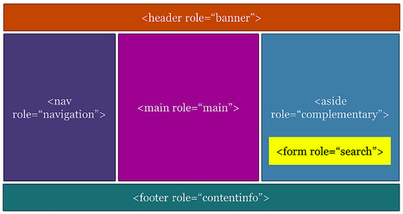

# An Intro to ARIA

Dennis E. Lembrée, Deque Systems

* [WAI-ARIA](#wai-aria)
  * [Introduction](#introduction)
  * [What is ARIA?](#what-is-aria-)
    * [Roles](#roles)
    * [States and Properties](#states-and-properties)
  * [Ground Rules](#ground-rules)
* [Keyboard Interaction](#keyboard-interaction)
  * [Keys](#keys)
  * [Keyboard Patterns](#keyboard-patterns)
  * [Tabbing](#tabbing)
  * [Design, develop and test](#design--develop-and-test)
* [Examples](#examples)
  * [Page Structure](#page-structure)
  * [Headings](#headings)
  * [Live Regions](#live-regions)
  * [Expand/Collapse](#expand-collapse)
  * [Modal Dialog](#modal-dialog)
  * [Menu Button](#menu-button)
  * [Tab Panel](#tab-panel)
* [Tools and Resources](#tools-and-resources)
  * [Tools](#tools)
  * [Resources](#resources)

Download slides (.pptx): http://bit.ly/aria2016bay

## WAI-ARIA

### Introduction

* W3C (World Wide Web Consortium) writes standards for JS, HTML, XML, etc.
* WAI (Web Accessibility Initiative) has great documentation and presentations, along with guidelines and techniques.
* ARIA (Accessible Rich Internet Applications)
  * WAI-ARIA 1.0, W3C proposed recommendation from Feb. 2014
  * v1.1 is an official candidate now

### What is ARIA?

* Fixes communication problems between web code and assistive technology
* Browsers and AT provide inconsistent support
* Essential for complex interactions and dynamic content
* Set of HTML attributes (aria-x and role)
  * Adds semantics
  * Doesn't change visuals
  * Doesn't "do" anything (still need to do the scripting, etc.)

#### Roles

* Widget roles
  * button, dialog, menu, radio, tab
* Document structure
  * list, presentation, row, separator
* Landmark roles
  * header, main, footer, complementary
* Caution! role="application"

#### States and Properties

* Widgets
  * aria-checked, aria-expanded, aria-haspopup, aria-label, aria-readonly, aria-required
* Live regions
  * aria-live, aria-busy
* Relationships
  * aria-controls, aria-describedby, aria-labelledby
* Drag-and-drop
  * aria-dropeffect, aria-grabbed

### Ground Rules

* ARIA changes HTML semantics (always overrides)
* ARIA doesn't solve all problems
* If in double, leave it out!
  * Focus on HTML semantics and keyboard interaction

Don't stray from proper web development techniques:

* Semantic markup
* Separate content (HTML), design (CSS), and behavior (JS)
* For behavior, add ARIA last!

If you can use a native HTML element or attribute with the semantics and behavior required, instead of ARIA, then do so!

* **Don't do:** `<span class="btn" role="button">Go</span>`
* **Do:** `<button>Go</button>`

Use much caution/discretion with:

* role="application"
* role="form"
* drag-and-drop

## Keyboard Interaction

* Users physically unable to manipulate a mouse
* Users who cannot see a mouse pointer
* Many ATs use keyboard-like input
* Anyone who types stuff!

### Keys

* TAB/shift+tab
  * Move to next/previous focusable element
* ENTER
  * Activate link or button
* SPACEBAR
  * Activate buttons, radios and checkboxes
* ARROW keys 
  * Change selection within a widget; move between options
* ESC
  * Close a widget (such as a modal/overlay)
  * Optional: always provide a close control on the screen

**Do buttons need to be activated by both ENTER and SPACEBAR?** WCAG 2.0 specifies ENTER, but it's good to to add both functionality because some users expect SPACEBAR to work.

Keyboard interaction often works differently with a screen reader.

### Keyboard Patterns

* Consider providing brief instructions to the user
* [ARIA keyboard patterns](https://www.w3.org/TR/wai-aria-practices/#aria_ex)

Why is this important? Because all of this must be programmed!

### Tabbing

* tabindex="0"
  * Puts the element in the tab order (allows elements besides links and form elements to receive keyboard focus)
  * Doesn't change the tab order, but places the element in the logical navigation flow, as if it were a link on the page
  * Use with great discretion
* tabindex="-1"
  * Removes the element from the default navigation flow
  * Allows things besides links and form elements to receive "programmatic" focus, meaning focus can be set to the element through scripting, links, etc.
  * Use with great discretion
* tabindex="1" (or greater than one)
  * Defines an explicit tab order
  * NEVER USE THIS!!!

Use tabindex with great discretion because you can probably simplify things by just using native HTML elements and not having to manage focus!

### Design, develop and test

* Functionality
  * Ability to focus and manipulate with keyboard
* Visual focus indication
* Tab order logical
* No keyboard trap

## Examples

### Page Structure

**HTML5 Structural Elements:** header, nav, main, section, article, aside, footer

**HTML5 Structural Elements + Landmark Roles**

* Header + banner (page header only)
* Nav + navigation
* Main + main
* Section + region*
* Article + article*
* Aside + complementary 
* [None] + search
* Footer + contentinfo (page footer only)

(* The region and article roles are technically not ARIA landmarks)



If a search box is labeled right, then role="search" can be annoying due to extra verbosity.

### Headings

* Use H elements, of course!
  * `<h1>Settings</h1>`
* Hack:
  *` <div role="heading" aria-level=“1”> Settings</div>`

**Sections should have headings!**

```
<section aria-labelledby="heading">
  <h1 id="heading">Headline Here</h1>
```

### Live Regions

* aria-live=off|polite|assertive
* aria-atomic=true|false
* Demo: http://bit.ly/aria-atomic-demo
* Examples in the wild:
  * Countdown timer on eBay auction pages
  * Easy Chirp character counter

### Expand/Collapse

* aria-expanded=true|false
* aria-controls
* aria-labelledby
* Demo: http://bit.ly/a11yexpand

### Modal Dialog

* role=dialog
* aria-labelledby/aria-label
* Demo: http://bit.ly/a11ymodal

### Menu Button

* role=menu, menuitem, presentation, button
* aria-labelledby
* aria-haspopup
* Demo: http://bit.ly/a11ymenubutton

### Tab Panel

* role=tablist, tab, tabpanel, presentation
* aria-controls
* aria-labelledby
* aria-selected
* Demo: http://bit.ly/a11ytabpanel

## Tools and Resources

* Always test with a screen reader
* Automated tools catch ~35% of issues
  * 35% statistic (30-40%) is oft quoted, various sources from research, automated tool results on hundreds of web pages, and experience

### Tools

* aXe: the accessibility engine
  * http://www.deque.com/products/axe/
  * http://bitly.com/aXe-Chrome
  * http://bit.ly/aXe-Firefox
* aViewer (inspector)
  * Windows app that inspects the accessibility API
  * http://www.paciellogroup.com/resources/aviewer
* Chrome Accessibility Inspector
  * Chrome developer tools (panel)
  * https://goo.gl/KUZDzs

### Resources

* Notes on Using ARIA in HTML (W3C)
  * https://www.w3.org/TR/aria-in-html/
* Make Your Widgets Sing With ARIA (by Jason Kiss)
  * http://bit.ly/13pObWq
* Hitting the accessibility high notes with ARIA (by Ted Drake)
  * http://www.last-child.com/accessibility-high-notes-aria/
* AccDC (by Bryan Garaventa)
  * http://whatsock.com/
* OpenAjax Accessibility
  * http://www.oaa-accessibility.org/examples/
